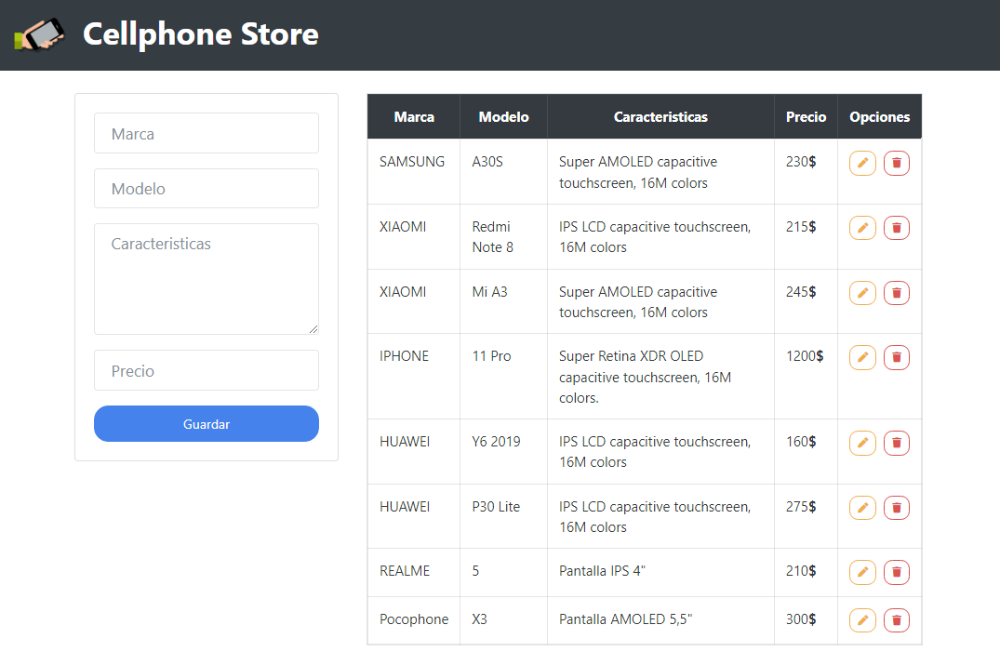

# Crud with PHP and Mysql  

## Table of Content

- [About The Project](#about-the-project)
  - [Description](#description)
  - [Built With](#built-with)
- [Installation](#installation)
- [Usage](#usage)
- [Contact](#contact)

## About The Project



## Description

This project is for a cell phone store that I made with PHP and uses MySQL as a database.

Said application performs CRUD operations to read, create, update and delete cell phones and for the user interface I used a variation of Bootstrap.

## Built With

[](https://www.php.net)

[](https://www.mysql.com)

[](https://getbootstrap.com)

## Installation

1. Clone the repo and change "my-project" to your project name.

```sh
  git clone https://github.com/josemiguel02/crud-php-mysql.git ./my-project
```

2. Go to the project directory

```sh
  cd my-project
```

3. Import database schema located at: **[sql/cellstore.sql](sql/cellstore.sql)**

## Usage

Run the project with [Xampp](https://www.apachefriends.org) or [Laragon](http://laragon.org)

## Contact

- Gmail - [josemidev24@gmail.com](mailto:josemidev24@gmail.com)
- Instagram - [@jmdp.02](https://www.instagram.com/jmdp.02)
